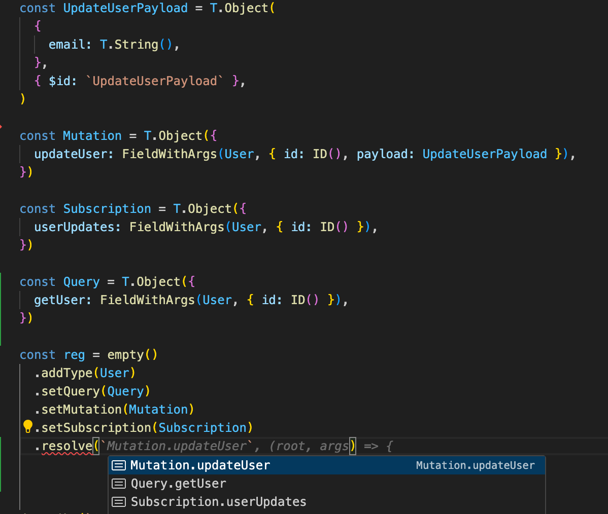

# README is TBD

I never liked GraphQL to TypeScript types codegen. I always felt it should be done the other way around
yet existing solutions still approached it from GraphQL end.
My idea was to use bi-directional introspectable schema to encode GraphQL typesystem
and derive GraphQL schema from it.
Unlike other code-first GraphQL schema type systems it allows for reusing existing well-known library 
for defining your GraphQL Data Transfer Objects with all benefits of encoding / decoding, JIT-compiled parsers and other goodness.  
It provides decent level of type-safety, even for convoluted GraphQL Interface use cases.  
API should be considered work-in-progress  

Basic E2E example can be found here [E2E test](src/__test__/typebox-graphql.test.ts)

Type test for subtyping GraphQL interface can be found here [type test](src/__test__/typebox-graphql.test-d.ts#L252)

Ideas and contributions are welcome!